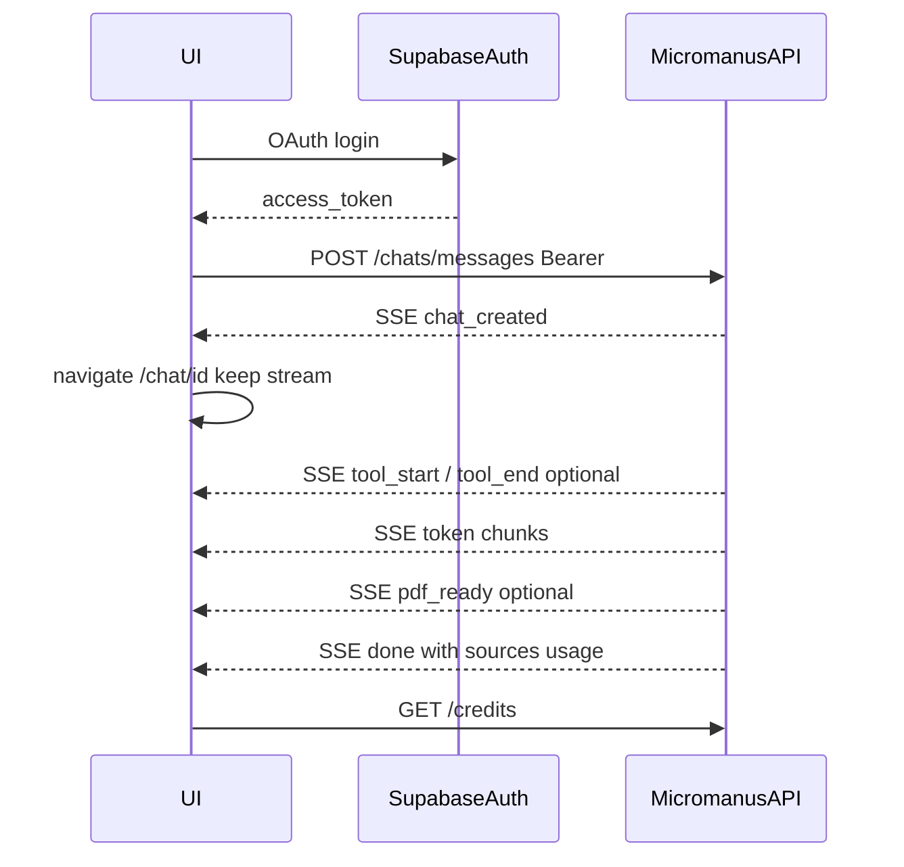

# FRONTEND_AGENTS.md

You are an AI implementation agent building the **micromanus** frontend: a multi-model, bring-your-own-key (BYOK) LLM chat UI with streaming, web-source citations, PDF tool results, and platform credits.

**Required stack:** React (Vite) · Tailwind CSS v4 · shadcn/ui · [AI Elements](https://elements.ai-sdk.dev/) · TanStack React Query · React Router · Supabase Auth.

This document is the contract between the frontend and the **already-implemented** micromanus backend. Build only against what is described here. Do not invent backend endpoints. Do not call LLM providers, Tavily, or Stripe APIs from the browser.

**Backend origin (local):** `http://localhost:4000`  
**Expected frontend (local):** Vite SPA on `http://localhost:5173` (Stripe success/cancel URLs are already configured for this)

There is **no** `/api` **path prefix**. Routes are `/chats/...`, `/api-keys`, `/credits`, etc.

---


# 1. Product (what to build)

micromanus lets an authenticated user:

1. Sign in with **Google or GitHub** (Supabase Auth).
2. Save their own **OpenAI / Claude / Gemini** API keys (BYOK).
3. Start a **new chat** by sending a message (chat is created lazily — there is no “create chat” API).
4. Stream an assistant reply, with optional **web search citations** and **PDF download links**.
5. Continue an existing chat, load history, and see sources.
6. Pick a **model** from a curated list.
7. Track **platform credit balance** and per-chat usage.
8. **Buy credits** via Stripe Checkout or **redeem a coupon**.

Platform credits meter access to micromanus (chats/tools/storage). The user pays their LLM provider directly via their own key. Credits are **not** a pass-through of provider cost.

---


# 2. Boundaries (frontend vs backend)


## Frontend owns

- UI, pages, routing, client state
- Supabase Auth (OAuth redirect / session / `access_token`)
- Calling the micromanus HTTP API with `Authorization: Bearer <access_token>`
- Parsing SSE chat streams
- Redirecting the browser to the Stripe Checkout `url` returned by the backend
- Client-side chat sidebar list (see §7 — backend has no list endpoint)


## Frontend must NOT

- Call OpenAI, Anthropic, Google, Tavily, or Stripe APIs directly
- Store or log full provider API keys after submit (show only masked `last_four`)
- Use `SUPABASE_SERVICE_ROLE_KEY`, `ENCRYPTION_KEY`, `STRIPE_SECRET_KEY`, `TAVILY_API_KEY`, or any other server secret
- Implement custom OAuth against Google/GitHub (Supabase Auth owns that)
- Add a standalone “create empty chat” call before the first message
- Assume a `GET /chats` list API exists


## Backend owns

- JWT verification, chat/message persistence, LLM orchestration, Tavily search, PDF generation + signed URLs, credit ledger, Stripe checkout session creation + webhooks, coupon redemption, BYOK encryption

---


# 3. Required tech stack

Use this stack. Do not substitute Next.js App Router, another CSS framework, or a different data/router library unless the product owner explicitly changes this document.

| Piece | Required choice |
| --- | --- |
| UI library | **React** (Vite SPA on port **5173**) |
| Styling | **Tailwind CSS v4** + **shadcn/ui** |
| Chat UI | **[AI Elements](https://elements.ai-sdk.dev/)** (Vercel + shadcn registry) |
| Server state | **TanStack React Query** (`@tanstack/react-query`) |
| Routing | **React Router** (`react-router`) |
| Auth | `@supabase/supabase-js` with Google + GitHub providers |
| Proxy / API | **Local:** Vite `server.proxy` → backend (no CORS needed). **Production (Vercel):** set `VITE_API_URL` to the backend origin; backend must set `CORS_ORIGINS` to the frontend origin(s). |

### 3.1 Scaffold notes

1. Create a **Vite + React + TypeScript** app (port `5173`).
2. Install **Tailwind CSS v4** and initialize **shadcn/ui** for Tailwind v4 (`components.json`, CSS variables, `cn` helper).
3. Add **AI Elements** via the CLI (preferred) or shadcn registry — see [AI Elements docs](https://elements.ai-sdk.dev/). Components land under something like `@/components/ai-elements/`.
4. Wrap the app in `QueryClientProvider` (React Query) and React Router’s `BrowserRouter` / `createBrowserRouter`.
5. AI Elements docs often show Next.js + `useChat` from `@ai-sdk/react`. **micromanus does not stream from the browser to providers.** Keep Vite + React Router; use AI Elements as **presentational** building blocks wired to this backend’s SSE API (§8). Do **not** point `useChat` at OpenAI/Anthropic/Google or invent a Next.js AI route that holds user keys.

### 3.2 AI Elements — use these for chat

Prefer AI Elements (and underlying shadcn primitives) over one-off chat chrome:

| Need | AI Elements (docs) | Wire to |
| --- | --- | --- |
| Scrollable thread | Conversation | Message list + streaming assistant |
| Bubbles / markdown | Message, MessageContent, MessageResponse | User + assistant text (stream `token` into assistant) |
| Composer | Prompt Input | `content` + send → `POST .../messages` |
| Model picker | Model Selector | `GET /models` → send `model` id |
| Citations | Sources / Inline Citation | SSE `done.sources` + `GET /chats/:chatId` sources |
| Tool / PDF affordance | Tool or Artifact-style chip | SSE `pdf_ready` / `done.pdf` |

Install only the elements you need (`npx ai-elements@latest` / `bunx ai-elements@latest`, or the shadcn registry flow). Non-chat screens (login, keys, credits) use **shadcn/ui** (Button, Input, Card, Form, Toast/Sonner, etc.).

### 3.3 React Query — what it owns

Use React Query for **JSON** reads/mutations. Keep the **SSE chat stream** in dedicated client state (context/store) so navigation on `chat_created` does not abort the stream.

| Query / mutation | Endpoint |
| --- | --- |
| `['me']` | `GET /me` |
| `['models']` | `GET /models` |
| `['api-keys']` | `GET /api-keys` |
| `['credits', chatId?]` | `GET /credits` |
| `['chat', chatId]` | `GET /chats/:chatId` |
| mutations | `POST/DELETE /api-keys`, `DELETE /chats/:chatId`, `POST /credits/checkout`, `POST /credits/redeem` |

Invalidate `['credits']` after successful chat `done`, checkout return, and redeem. Invalidate `['api-keys']` after save/delete. Invalidate `['chat', chatId]` after a successful follow-up `done` if you are not merging SSE into local cache yourself.

### 3.4 Suggested Vite proxy

```ts
// vite.config.ts
server: {
  port: 5173,
  proxy: {
    "/health": "http://localhost:4000",
    "/me": "http://localhost:4000",
    "/api-keys": "http://localhost:4000",
    "/chats": "http://localhost:4000",
    "/credits": "http://localhost:4000",
    "/models": "http://localhost:4000",
  },
}
```

With a proxy, the browser calls same-origin paths (e.g. `fetch("/models")`). On **Vercel Production**, there is no Vite proxy — set `VITE_API_URL=https://<backend>.vercel.app` and configure backend `CORS_ORIGINS` to include the frontend origin.

---


# 4. Features → pages → components


## 4.1 Feature map


| Feature                 | Page(s)          | Backend                                                          |
| ----------------------- | ---------------- | ---------------------------------------------------------------- |
| Login (Google / GitHub) | `/login`         | Supabase Auth → then `GET /me`                                   |
| New chat composer       | `/` or `/new`    | `POST /chats/messages` (SSE)                                     |
| Existing chat           | `/chat/:chatId`  | `GET /chats/:chatId`, `POST /chats/:chatId/messages`, `DELETE /chats/:chatId` |
| Model picker            | composer         | `GET /models`                                                    |
| BYOK keys               | `/settings/keys` | `GET/POST/DELETE /api-keys`                                      |
| Credits                 | `/credits`       | `GET /credits`, `POST /credits/checkout`, `POST /credits/redeem` |
| Citations               | chat view        | SSE `done.sources` + `GET /chats/:chatId` `sources`              |
| PDF from tools          | chat view        | SSE `pdf_ready` / `done.pdf` + `GET /chats/:chatId` message `pdf` |


## 4.2 Pages / routes


| Route            | Purpose                                                                 |
| ---------------- | ----------------------------------------------------------------------- |
| `/login`         | OAuth buttons; redirect to `/` when session exists                      |
| `/` or `/new`    | Empty composer only — **nothing persisted** until first send            |
| `/chat/:chatId`  | Message list + composer; hydrate via `GET /chats/:chatId`               |
| `/settings/keys` | Save / list (masked) / delete provider keys                             |
| `/credits`       | Balance, buy credits, redeem coupon; handle `?checkout=success|cancel` |


Optional: `/settings` layout wrapping keys. Protect all non-login routes with an auth gate.

## 4.3 Components to build

### Chat (AI Elements + thin wrappers)

| Component / area | Build with | Role |
| --- | --- | --- |
| Conversation thread | AI Elements `Conversation` + `Message*` | History + streaming assistant bubble |
| Composer | AI Elements `Prompt Input` | Textarea + send; disable while streaming |
| Model picker | AI Elements `Model Selector` | Options from `GET /models` (`label` / `id`) |
| Citations | AI Elements `Sources` / Inline Citation | Per-assistant-message sources |
| PDF / tool result | AI Elements `Tool` or small Artifact-style chip | **View PDF** from `pdf_ready` / `done.pdf` / message `pdf` |

### App chrome (shadcn/ui)

| Component | Role |
| --- | --- |
| `AuthProvider` / session gate | Hold Supabase session; redirect unauthenticated users to `/login` |
| `AppShell` | Sidebar + top bar (balance badge, settings link) — shadcn layout primitives |
| `ChatSidebar` | Client-side list of chats (localStorage — see §7); delete removes server chat + local item |
| `CreditBadge` | Remaining balance from React Query `['credits']` |
| `ApiKeyForm` | Provider select + key input; list shows `••••{last_four}` |
| `BuyCreditsForm` | Amount input (≥ 5 credits at $1 each) → Stripe Checkout |
| `CouponForm` | Code input → redeem |
| Toasts | shadcn Sonner/Toast — map `{ error, code }` and SSE `error` events |

Do not overbuild dashboards, admin coupon CRUD, or key-reveal UIs. Do not replace AI Elements chat surfaces with custom markdown stacks unless an element is missing.

---


# 5. Auth

1. Configure Supabase Auth with Google and GitHub (same Supabase project as the backend).
2. On login success, keep `session.access_token`.
3. On every micromanus API request:

```http
Authorization: Bearer <supabase_access_token>
Content-Type: application/json
```

1. Call `GET /me` after login to confirm the backend upserted the user and to show `name` / `email`.
2. On `401` with `code: "unauthorized"`, clear session and send the user to `/login`.

The backend never implements OAuth redirects. Missing/invalid tokens → `401`.

---


# 6. Data fetching patterns

Use **React Query** for all authenticated JSON API calls. Put a thin `api()` helper under `queryFn` / `mutationFn`. Keep SSE streaming outside React Query (see §6.3).

## 6.1 JSON helpers

```ts
async function api<T>(path: string, init: RequestInit & { token: string }): Promise<T> {
  const res = await fetch(path, {
    ...init,
    headers: {
      Authorization: `Bearer ${init.token}`,
      ...(init.body ? { "Content-Type": "application/json" } : {}),
      ...init.headers,
    },
  });
  if (res.status === 204) return undefined as T;
  const body = await res.json().catch(() => ({}));
  if (!res.ok) {
    throw Object.assign(new Error(body.error ?? "request_failed"), {
      status: res.status,
      code: body.code ?? "unknown",
    });
  }
  return body as T;
}
```

Canonical error shape (non-SSE):

```ts
{ error: string; code: string }
```

Surface React Query errors via toasts using `error.code` when present.

## 6.2 When to refetch / invalidate


| After… | React Query action |
| --- | --- |
| Login | Prefetch/invalidate `['me']`, `['credits']`, `['models']`, `['api-keys']` |
| Chat `done` (ok) | Invalidate `['credits']`; merge sources from SSE or invalidate `['chat', chatId]` |
| Open `/chat/:chatId` | `useQuery(['chat', chatId])` → `GET /chats/:chatId` |
| Checkout return (`?checkout=success`) | Invalidate `['credits']` (webhook may lag — `refetchInterval` briefly or retry) |
| Coupon redeem | Prefer mutation response `balance`; also invalidate `['credits']` |
| Save/delete API key | Invalidate `['api-keys']` |


## 6.3 Optimistic UI for chat (SSE, not React Query)

1. Append the user message locally immediately (feed AI Elements `Message` list).
2. Append an empty assistant placeholder and stream `token` text into it (`MessageResponse`).
3. On `done.ok === true`, set `messageId`, attach `sources` / `pdf`, invalidate credits.
4. On `done.ok === false`, mark the assistant bubble failed; do not invent a final message id.
5. Never assume the assistant message is persisted until `done` with `ok: true`.
6. Hold stream state **above** the React Router outlet so `/new` → `/chat/:id` does not remount-away the in-flight `fetch`.
---


# 7. Chat UX (critical flows)


## 7.1 New chat (lazy create)

There is **no** create-chat endpoint. `/new` is client-only.

```
User on /new → POST /chats/messages { content, model }
  → SSE chat_created { chatId }     // navigate here WITHOUT aborting the stream
  → SSE tool_start / tool_end*      // agent loop (search, pdf, …) — optional UI status
  → SSE token { text }*             // keep streaming on /chat/:chatId
  → SSE pdf_ready? { chatId, url, filename }  // may arrive during tool_end for create_pdf
  → SSE done { ok, ... }
```

**Important:** On `chat_created`, use client-side navigation to `/chat/:chatId` while keeping the same `fetch` stream open (e.g. hold stream state in a module/context above the route). Do not cancel the request on navigate.

Title suggestion: derive a sidebar title from the first user message (truncate). Backend `title` may be null.

## 7.2 Follow-up message

```
POST /chats/:chatId/messages { content, model }
  → SSE tool_start / tool_end*
  → SSE token*
  → SSE pdf_ready?
  → SSE done
```

No `chat_created` event on this route.

## 7.3 Hydrate existing chat

`GET /chats/:chatId` → messages, sources, usage. Group `sources` by `message_id` for citation UI.

Each message may include optional `pdf?: { url, filename }` (freshly signed, ~24h) when that assistant turn produced a PDF. Map it onto the UI message so a **View PDF** control works after reload — do not rely only on live SSE.

Wrong owner / missing chat → `404` `chat_not_found` (treat as not found; do not show “forbidden”).

## 7.4 Chat sidebar without `GET /chats`

The backend **does not** expose a chat list. Maintain local history, e.g. `localStorage`:

```ts
type ChatListItem = {
  chatId: string;
  title: string;
  updatedAt: string; // ISO
};
```

Update on `chat_created` and after successful `done`. Opening a chat still hydrates from `GET /chats/:chatId`. Clearing storage only loses the sidebar, not server data.

**Delete:** sidebar trash → confirm → `DELETE /chats/:chatId` (204). On success, remove the local list item, clear stream state if that chat was open, and navigate to `/new`. Server removes the chat row (messages/sources/usage cascade) and Storage PDFs under `chat-pdfs/{userId}/{chatId}/`.

## 7.5 Prerequisites before send

Fail fast in the UI when possible:

- No session → login
- No key for the selected model’s `provider` → prompt to `/settings/keys`
- Balance `<= 0` → prompt to `/credits`

Backend still enforces: `402 insufficient_credits`, `400 api_key_not_configured`, `400 unknown_model`.

---


# 8. SSE streaming protocol

Chat message routes return **Server-Sent Events**, not a single JSON body.

### Response headers (set by backend)

- `Content-Type: text/event-stream; charset=utf-8`
- Status **200** once the stream starts


### Wire format

```
event: <name>
data: <json>

```

Native `EventSource` only supports GET — **you must parse SSE from a POST** `fetch` **ReadableStream**.

### Events


| Event          | When                                    | Data                                              |
| -------------- | --------------------------------------- | ------------------------------------------------- |
| `chat_created` | Only `POST /chats/messages`, before LLM | `{ chatId: string }`                              |
| `tool_start`   | Before each tool execute in agent loop  | `{ chatId, toolName, toolCallId }`                |
| `tool_end`     | After each tool execute finishes        | `{ chatId, toolName, toolCallId, ok: boolean }`   |
| `token`        | Each text delta                         | `{ text: string }`                                |
| `pdf_ready`    | Mid-stream when PDF tool succeeds       | `{ chatId, url, filename }`                       |
| `error`        | Stream failure                          | `{ message: string, code: string }`               |
| `done`         | Always ends the stream                  | see below                                         |

`tool_start` / `tool_end` carry **names and ids only** (no tool args/results). Known `toolName` values today: `web_search`, `create_pdf`. Safe to ignore if the UI does not show agent activity.


`done` **success:**

```ts
{
  ok: true;
  chatId: string;
  messageId: string;
  usage: {
    inputTokens: number;
    outputTokens: number;
    cachedTokens: number;
    creditsCharged: number;
  };
  sources: Array<{ title: string; url: string }>;
  pdf?: { url: string; filename: string };
}
```

`done` **failure:** `{ ok: false }` (usually after an `error` event).

SSE `error` codes: `empty_response` | `credit_error` | `llm_failed`.

### Pre-stream errors

If auth/credits/key/validation fail **before** SSE starts, the response is normal JSON `{ error, code }` with 4xx/5xx — not SSE. Check `Content-Type` / status before parsing as SSE.

### PDF URLs

Signed Supabase Storage URLs, ~**24h** expiry. Show a **View PDF** control from `pdf_ready`, `done.pdf`, or `message.pdf` on hydrate — open in a new tab for inline browser viewing (no `download` attribute / no Storage `download` signed-URL option). Do **not** parse download links from assistant markdown (the model is not given a pasteable URL; any storage sign URLs in text are scrubbed). Re-sign happens server-side on `GET /chats/:chatId` — there is no separate “re-sign PDF” API.

---


# 9. API contract

All authenticated routes require Bearer JWT unless noted.

## 9.1 Health

`GET /health` → `{ ok: true }` (no auth)

## 9.2 Me

`GET /me` → `{ id, name, email, created_at }`

## 9.3 Models

`GET /models` → `{ models: ModelDefinition[] }`

```ts
type ModelDefinition = {
  id: string;
  provider: "openai" | "claude" | "gemini";
  label: string;
};
```

Current catalog (use `id` in message bodies):


| id                           | provider | label             |
| ---------------------------- | -------- | ----------------- |
| `gpt-5.4-mini`               | openai   | GPT-5.4 Mini      |
| `gpt-5.4-nano`               | openai   | GPT-5.4 Nano      |
| `claude-sonnet-4-5-20250929` | claude   | Claude Sonnet 4.5 |
| `claude-haiku-4-5-20251001`  | claude   | Claude Haiku 4.5  |
| `gemini-2.5-flash`           | gemini   | Gemini 2.5 Flash  |
| `gemini-2.5-pro`             | gemini   | Gemini 2.5 Pro    |


Prefer loading from `GET /models` at runtime rather than hardcoding.

## 9.4 API keys (BYOK)

Providers: `openai` | `claude` | `gemini`

**POST** `/api-keys`

```json
{ "provider": "openai", "apiKey": "sk-..." }
```

→ `{ provider, last_four, created_at, updated_at }`

Shape hints (backend validates basically): OpenAI `sk-…`, Claude `sk-ant-…`, Gemini length ≥ 20.

**GET** `/api-keys` → `{ keys: ApiKeyPublic[] }`  
Never expect ciphertext or full key.

**DELETE** `/api-keys/:provider` → `204` empty body

## 9.5 Chats

**POST** `/chats/messages` (new chat)

```json
{ "content": "Hello", "model": "gpt-5.4-mini" }
```

→ SSE (see §8)

**POST** `/chats/:chatId/messages` (existing)

Same body → SSE without `chat_created`

**GET** `/chats/:chatId`

```ts
{
  id: string;
  title: string | null;
  created_at: string;
  messages: Array<{
    id: string;
    chat_id: string;
    role: "user" | "assistant";
    content: string;
    model: string | null;
    created_at: string;
  }>;
  sources: Array<{
    id: string;
    chat_id: string;
    message_id: string;
    source_link: string;
    content: string;
    created_at: string;
  }>;
  usage: Array<{
    id: string;
    user_id: string;
    chat_id: string;
    model_name: string;
    provider: "openai" | "claude" | "gemini";
    input_tokens: number;
    output_tokens: number;
    cached_tokens: number;
    credits_charged: number;
    created_at: string;
  }>;
}
```

**DELETE** `/chats/:chatId` → `204` empty body

Permanently deletes the chat for the authenticated owner: messages, sources, per-chat credit usage rows (Postgres cascade), and PDF objects in the `chat-pdfs` bucket for that chat. Wrong owner / missing → `404` `chat_not_found`.


## 9.6 Credits

**GET** `/credits?chatId=` (optional filter)

```ts
{
  balance: number;
  usageByChat: Array<{
    chatId: string;
    title: string | null;
    models: Array<{
      modelName: string;
      provider: "openai" | "claude" | "gemini";
      inputTokens: number;
      outputTokens: number;
      cachedTokens: number;
      /** Estimated provider API cost in USD (BYOK list prices). */
      costUsd: number;
    }>;
  }>;
}
```

Chats are ordered by most recent usage. Within each chat, token totals and estimated USD cost are aggregated per model.

**POST** `/credits/checkout`

```json
{ "credits": 5 }
```

- **$1 per credit** (`amountPaidCents = credits × 100`)
- **Minimum 5 credits** per checkout (`credits` must be an integer ≥ 5)
- Below minimum or non-integer → `400` `invalid_credits`

→ `{ url: string, sessionId: string }`  
Frontend: `window.location.assign(url)`.

Success return (backend-configured):  
`/credits?checkout=success&session_id={CHECKOUT_SESSION_ID}`  
Cancel: `/credits?checkout=cancel`

Show a success/cancel banner; refetch balance. Do not call Stripe from the client.

**POST** `/credits/redeem`

```json
{ "code": "WELCOME100" }
```

→ `{ code, creditsGranted, balance }`  
Welcome coupon grants **5** credits (`creditsGranted: 5`). Codes are trimmed/uppercased server-side.

## 9.7 Webhooks

`POST /webhooks/stripe` is **server-only** (Stripe signature). Do not call from the frontend.

---


# 10. Error codes (handle in UI)


| Status | code                                                      | Suggested UX          |
| ------ | --------------------------------------------------------- | --------------------- |
| 400    | `invalid_body`                                            | Fix form validation   |
| 400    | `invalid_provider` / `invalid_api_key`                    | Key form error        |
| 400    | `api_key_not_configured`                                  | CTA → settings/keys   |
| 400    | `unknown_model`                                           | Refresh models list   |
| 400    | `invalid_credits`                                         | Enter ≥ 5 credits     |
| 400    | `coupon_inactive` / `coupon_expired` / `coupon_exhausted` | Coupon error          |
| 401    | `unauthorized`                                            | Re-login              |
| 402    | `insufficient_credits`                                    | CTA → credits         |
| 404    | `chat_not_found`                                          | Redirect to `/new`    |
| 404    | `api_key_not_found`                                       | Refresh key list      |
| 404    | `coupon_not_found`                                        | Invalid code          |
| 409    | `coupon_already_redeemed`                                 | Already used          |
| 503    | `service_unavailable` / `*_not_configured`                | Backend misconfigured |


---


# 11. Frontend environment

Public only:


| Variable                 | Purpose                                                        |
| ------------------------ | -------------------------------------------------------------- |
| `VITE_SUPABASE_URL`      | Same project URL as backend `SUPABASE_URL`                     |
| `VITE_SUPABASE_ANON_KEY` | Supabase anon/public key                                       |
| `VITE_API_URL`           | **Required on Vercel.** Backend origin, no trailing slash (e.g. `https://api.vercel.app`). Leave unset locally when using the Vite proxy. |


Never put service-role, encryption, Stripe secret, webhook secret, or Tavily keys in the frontend.

---


# 12. Sequence: first message




---


# 13. Product decisions the UI must respect

1. **Lazy chat creation** — first message creates the chat; emit/navigate on `chat_created`.
2. **BYOK** — user must save a key for the model’s provider before chatting.
3. **Platform credits** — chat requires `balance > 0`. Note: token→credit rates are currently **placeholder zeros** (`creditsCharged` may be `0`), but the balance gate still applies.
4. **404 not 403** for other users’ chats — show not found.
5. **Masked keys only** — `last_four`, never full key reveal.
6. **Tools are model-driven** — the server runs a multi-step agent loop (think → tool → observe → repeat); UI may show status from `tool_start`/`tool_end`, and displays tokens, sources, and PDF links.
7. **No chat list API** — use client-side history until the backend adds one.

---


# 14. Out of scope for the frontend agent

- Stripe webhook handling or admin coupon management
- Implementing OAuth token exchange yourself
- Calling providers with the user’s key from the browser
- Empty-chat create endpoints
- Skipping `VITE_API_URL` + backend `CORS_ORIGINS` on Vercel (local Vite proxy does not apply in production)
- Building backend routes in this frontend project
- Switching away from the required stack (React, Tailwind v4, shadcn, AI Elements, React Query, React Router)
- Using `@ai-sdk/react` `useChat` against providers or a frontend-held API key instead of this backend’s SSE chat API
---


# 15. Suggested implementation order

1. Vite + React + TypeScript; Tailwind CSS v4 + shadcn/ui; React Router; React Query provider; Supabase Auth (`/login`, session gate)
2. API client + Vite proxy + `useQuery(['me'])`
3. Install AI Elements (Conversation, Message, Prompt Input, Model Selector, Sources at minimum)
4. Settings: API keys CRUD (shadcn forms + React Query mutations)
5. Credits page: balance, buy credits (min 5 @ $1), redeem, checkout redirect + return query
6. `/new` composer with Prompt Input + Model Selector; SSE client + `chat_created` navigation
7. `/chat/:chatId` hydrate via React Query + follow-up messages; Conversation/Message streaming
8. Sources + PDF chip + credit badge
9. Client-side chat sidebar (localStorage)
10. Polish error mapping (`402`, missing key, stream failures)

---


# 16. Manual smoke checklist

1. Log in with Google/GitHub → `GET /me` returns profile.
2. Save an OpenAI (or Claude/Gemini) key → list shows `••••xxxx`.
3. Open `/credits` with balance `> 0` (or redeem a test coupon / complete test checkout).
4. From `/new`, send a message → receive `chat_created` → URL becomes `/chat/{id}` → tokens stream → `done`.
5. Reload `/chat/{id}` → history and sources load.
6. Send a follow-up → stream without `chat_created`.
7. Ask for a PDF report → see `pdf_ready` link.
8. Delete a provider key → new chat with that provider’s model fails with clear CTA.
9. With balance `0`, send fails with credits CTA.

Watch the backend terminal for streaming / tool / billing logs while testing.